# Kubernetes-Native Telemetry API Server

A high-performance, containerized API server that provides unified access to cluster telemetry data (metrics, traces, and CRDs) stored in ClickHouse, serving as the data backbone for operational UI dashboards.

## Overview

This project delivers a **Kubernetes-native solution** for accessing and visualizing cluster observability data. Built with Go and React, it bridges the gap between raw telemetry data in ClickHouse and intuitive operational dashboards for Site Reliability Engineers and Platform Engineers.

### Key Features

- **📊 Unified Telemetry Access**: Single API for metrics, distributed traces, and Custom Resource Definitions (CRDs)
- **🚀 High-Performance Backend**: Go-based gRPC API server optimized for ClickHouse queries
- **🔒 Kubernetes-Native Security**: RBAC integration with ServiceAccount-based authentication
- **🎯 Operational Focus**: Purpose-built for cluster health monitoring and incident response
- **📱 Modern UI**: React dashboard with real-time data visualization and interactive exploration

## Architecture

```mermaid
flowchart TD
    User[👤 SRE/DevOps Engineer] --> UI[🖥️ React Dashboard]
    UI -->|gRPC-Web| APIServer[⚡ Go API Server]
    APIServer -->|Optimized SQL| ClickHouse[(🗄️ ClickHouse)]
    APIServer -->|RBAC| K8s[☸️ Kubernetes API]
    
    subgraph "Core Endpoints"
        Metrics[📊 /metrics]
        Traces[🔍 /traces] 
        CRDs[📋 /crds]
        Query[💻 /query]
    end
    
    APIServer --> Metrics
    APIServer --> Traces
    APIServer --> CRDs
    APIServer --> Query
```



## Technology Stack

### Backend
- **Language**: Go (1.21+)
- **Protocol**: gRPC with gRPC-Web browser compatibility
- **Database**: ClickHouse (v23.8+) for time-series and operational data
- **Deployment**: Docker containers on Kubernetes with Helm charts

### Frontend  
- **Framework**: React (v18+) with TypeScript (v5+)
- **Data Fetching**: React Query with gRPC-Web client
- **UI Components**: Material-UI with custom visualization libraries
- **Charts**: Victory/Recharts for metrics and tracing visualizations

### Infrastructure
- **Orchestration**: Kubernetes (RBAC-integrated)
- **Configuration**: ConfigMaps and Secrets
- **Packaging**: Helm (v3+) for deployment management
- **Observability**: OpenTelemetry instrumentation throughout

## User Experience

### Target Users
- **Cluster Admins & SREs**: Investigate alerts, explore metrics/traces, diagnose production issues
- **Platform/DevOps Engineers**: Verify data ingestion, manage dashboards, configure access controls

### Core Workflows
1. **🔐 Authentication**: Google OIDC → JWT → Kubernetes ServiceAccount mapping
2. **📈 Metrics Exploration**: Time-series visualization with faceted filtering
3. **🔍 Trace Investigation**: Waterfall views with span detail analysis  
4. **📋 Resource Inspection**: CRD browser with YAML/status viewing
5. **💻 Ad-hoc Querying**: SQL editor for custom ClickHouse queries

## Development Conventions

### AI-First Principles
- **📏 File Size Limit**: Maximum 500 lines per file for optimal AI compatibility
- **📝 Documentation**: `@fileoverview` required for every file
- **🏷️ Descriptive Naming**: Clear, searchable function and variable names
- **🧩 Modular Design**: Functional patterns, composition over inheritance

### Project Structure
```
/
├── cmd/apiserver/           # Application entry points
├── pkg/                     # Core Go packages
│   ├── api/                 # gRPC service implementations  
│   ├── clickhouse/          # Database client & query builders
│   └── auth/                # RBAC and authentication
├── frontend/src/            # React application
│   ├── components/          # Reusable UI components
│   ├── services/            # gRPC client services
│   └── pages/               # Route-level components
├── proto/                   # Protocol buffer definitions
├── deployments/helm/        # Kubernetes deployment charts
└── _docs/                   # Project documentation
```

### Code Quality Standards
- **📊 Test Coverage**: Minimum 80% unit test coverage
- **🔍 Code Review**: AI-compatibility and performance focus
- **📚 Documentation**: JSDoc/GoDoc blocks for all public functions
- **🛡️ Security**: Input validation and RBAC verification

## Quick Start

### Prerequisites
- Go 1.21+
- Node.js 18+
- Docker
- Kubernetes cluster
- ClickHouse instance

### Development Setup
```bash
# Clone repository
git clone <repository-url>
cd new-ai-project-tutorial

# Backend development
cd cmd/apiserver
go mod download
go run main.go

# Frontend development  
cd frontend
npm install
npm run dev

# Deploy to Kubernetes
helm install telemetry-api deployments/helm/
```

## Project Phases

- **Phase 1**: Core API implementation with basic endpoints
- **Phase 2**: Enhanced UI with advanced visualization features  
- **Phase 3**: Production-ready deployment with monitoring and alerting

---

For detailed setup instructions, architecture decisions, and development guidelines, see the `_docs/` directory.

## Contributing

This project follows strict AI-first development principles. Please review `_docs/resources/project-rules.md` for coding standards and contribution guidelines before submitting pull requests.
