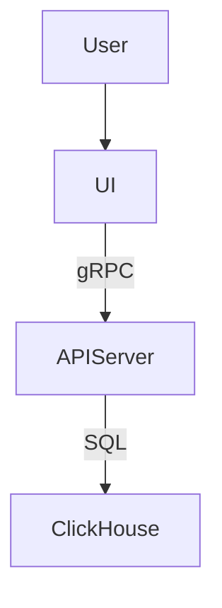

# User Flow

This document describes how **end-users** interact with the Kubernetes-native API server and its accompanying UI dashboard.  
It will later guide our architectural and UI decisions.

---

## 1. Personas

| Persona | Primary Goal | Typical Actions |
|---------|--------------|-----------------|
| **Cluster Admin / SRE** | Maintain cluster health and diagnose production issues. | • Investigate alerts • Explore metrics & traces • Inspect CRD state |
| **Platform / DevOps Engineer** | Provide internal teams with observability data & self-service tooling. | • Verify ClickHouse ingestion • Fine-tune queries & dashboards • Manage RBAC / access |

---

## 2. High-Level Journey

1. **Access**  
   The user opens the dashboard URL exposed via an LoadBalancer External IP or ClusterIP.

2. **Authenticate**  
   • SSO through Google OIDC → a short-lived JWT.  
   • The token maps to a Kubernetes `ServiceAccount` with RBAC rules for the API.

3. **Landing Page**
   - A series of widgets showing high-level alerts and overall health of the system.

4. **Explore Metrics**  
   - Landing page shows key health indicators retrieved from `/metrics`.  
   - Time-range picker & auto-refresh options.
   - If multiple clusters or namespaces exist, the user selects a **Cluster** and **Namespace** from a dropdown.

5. **Dive into Traces**  
   - User clicks a metric anomaly → deep-link to `/traces` pre-filtered on service & time window.  
   - Trace waterfall + span details.

6. **Inspect CRDs**  
   - Navigate to **Resources** tab.  
   - Search / filter specific custom resources (e.g., `VirtualService`, `Deployment`).  
   - View YAML + status conditions.

7. **Ad-hoc Query**  
   - Advanced users open **Query Lab** page (fronting `/query`).  
   - Build or paste SQL, preview results, then **Save** as a reusable panel.

8. **Export / Share**  
   - Download YAML/JSON or copy a shareable link (encodes current filters & time-range).  
   - Optionally create an alert rule (future phase).

9. **Sign-out**  
   - Explicit logout or token expiry triggers re-authentication.

---

## 3. Screen-by-Screen Detail

### 3.1 Dashboard Landing
- **Header**: Cluster/Namespace selector • Time-range picker • User avatar
- **Widgets**: CPU, Memory, Network, Error Rate
- **Call-to-Action**: “Investigate in Traces”

### 3.2 Metrics Explorer
- Multi-series charts with ClickHouse-backed aggregation
- Faceted filters (pod, workload, node)

### 3.3 Tracing View
- Trace list → Waterfall view → Span detail side-panel
- Error/latency heatmap

### 3.4 CRD Browser
- Table listing CRD kinds & counts
- Click -> resource list -> YAML/stats

### 3.5 Query Lab
- SQL editor with schema auto-complete
- Result grid + chart preview
- Save / share query

---

## 4. Data Flow Diagram (to be added)

_(Replace or extend once we finalise networking/auth decisions.)_

---

## 5. Future Considerations

* **Multi-Tenant Separation** – Namespace-level or cluster-level isolation will be required in a later phase but is **out of scope for the MVP**.

---
